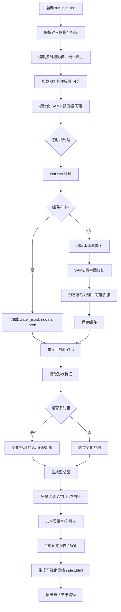

# flood-sam2-detection

基于多时相 SAR 影像的洪水水体自动提取、变化检测、质量评估、预警分析与可视化展示项目。

项目主流程由 [flood_detection.py](file:///c:/Users/10196/OneDrive/桌面/workplace/graduate/flood_detection.py) 实现，网页仪表盘模板由 [flood_web.py](file:///c:/Users/10196/OneDrive/桌面/workplace/graduate/flood_web.py) 生成，输出为可直接打开的 `index.html`。

## 功能概览

- 多时相 `tif/tiff` 影像读取与尺寸对齐
- 水体概率图构建 + SAM2 分割（不可用时自动回退概率图分割）
- 变化检测（持续 / 消退 / 新增）与可视化输出
- 质量评估
  - 有标注：IoU / Precision / Recall / F1 / 面积准确率
  - 无标注：自检模式（覆盖合理性、概率一致性、连通性）
- 预警报告生成（`warning_report.json`）
- 单文件网页仪表盘生成（`index.html`）

## flood_detection.py 流程图



## 目录结构

```text
graduate/
├─ flood_detection.py         # 主流程：分割、评估、预警、输出
├─ flood_web.py               # 网页模板生成器（内联 HTML/CSS/JS）
├─ output/                    # 运行输出目录（默认）
└─ sam2/                      # 可选：SAM2 模型与配置（如启用）
```

## 环境要求

- Python 3.10+
- 建议系统：Windows / Linux（项目已在 Windows 路径下使用）

核心依赖（按代码导入）：

- `numpy`
- `opencv-python`
- `matplotlib`
- `rasterio`
- `torch`
- `python-dotenv`
- `langchain-openai`（可选，用于 LLM 评审与预警文本增强）

可按需安装：

```bash
pip install numpy opencv-python matplotlib rasterio torch python-dotenv langchain-openai
```

## 快速开始

### 1) 准备影像

将待处理的 SAR 影像（`.tif/.tiff`）放入同一目录，建议按时间顺序命名。

### 2) 直接运行

```bash
python flood_detection.py --input-dir "你的影像目录"
```

如果不传 `--input-files`，程序会自动扫描 `--input-dir` 下的 `tif/tiff` 文件。

### 3) 指定文件运行

```bash
python flood_detection.py ^
  --input-files "d27.tif" "d28.tif" "d29.tif" ^
  --labels "d27" "d28" "d29" ^
  --out-dir "output"
```

## 主要参数说明

CLI 参数定义见 [build_parser](file:///c:/Users/10196/OneDrive/桌面/workplace/graduate/flood_detection.py#L1075-L1086)。

- `--input-files`：显式指定输入影像列表
- `--input-dir`：输入目录（未指定 `--input-files` 时生效）
- `--labels`：每期影像标签（数量需与输入一致）
- `--ground-truth-files`：标注掩膜列表（用于标准质量评估）
- `--out-dir`：输出目录（默认 `output/`）
- `--pixel-area-m2`：单像素面积（默认 25.0 m²）
- `--disable-sam2`：禁用 SAM2，使用概率图分割
- `--force-rerun`：忽略缓存，强制重跑
- `--post-dilate-k`：后处理膨胀核大小（默认 `3`，`0` 表示关闭）

### 关于 `--post-dilate-k`

- 用途：增强水体连通性（在后处理阶段执行膨胀）
- 建议取值：`0 / 3 / 5`
- 风险：值越大越可能导致面积偏大

示例：

```bash
python flood_detection.py --input-dir "data" --post-dilate-k 3
```

## 可选 LLM 配置

项目通过环境变量读取 SiliconFlow 配置（可不配，不影响主流程）：

- `SILICONFLOW_API_KEY`

相关代码位置：
- [LLM 配置](file:///c:/Users/10196/OneDrive/桌面/workplace/graduate/flood_detection.py#L60-L63)
- [LLM 调用接口](file:///c:/Users/10196/OneDrive/桌面/workplace/graduate/flood_detection.py#L554-L580)

## 输出结果说明

默认输出到 `output/`，常见文件包括：

- `{label}_prob_map.png`：概率图
- `{label}_seg_only.png`：分割纯叠加图
- `{label}_water_result.png`：分割结果图
- `change_{t1}_{t2}.png`：相邻时相变化图
- `summary.png`：汇总图
- `warning_report.json`：结构化预警报告
- `index.html`：可交互可视化页面
- `{label}_mask_cache.npz`：缓存文件（含掩膜、概率图、参数信息）

对应逻辑可见 [输出生成部分](file:///c:/Users/10196/OneDrive/桌面/workplace/graduate/flood_detection.py#L928-L958)。

## 质量评估机制

实现见 [质量评估模块](file:///c:/Users/10196/OneDrive/桌面/workplace/graduate/flood_detection.py#L413-L537)：

- 有标注时：与 GT 逐像素对比，计算 IoU/F1 等指标
- 无标注时：启用自检评分，输出 `reference_source=self_validation`

## 网页可视化

网页模板由 [flood_web.py](file:///c:/Users/10196/OneDrive/桌面/workplace/graduate/flood_web.py) 直接生成单文件 HTML，包含：

- KPI 指标卡
- 时序缩略图
- 滑动对比（Before/After）
- 趋势图与变化图
- 可排序变化矩阵
- 质量指标条形图与建议面板

可直接双击 `output/index.html` 浏览。

## 常见问题

- **Q: 程序在“洪水预警分析”阶段停很久？**  
  A: 通常是外部 LLM 请求等待；未配置 API Key 时会自动走本地兜底逻辑。

- **Q: 为什么评估显示“自检模式，无标注参考”？**  
  A: 未提供 `--ground-truth-files`，程序不会进行标准 GT 对比。

- **Q: 改了后处理参数但结果没变化？**  
  A: 缓存会校验关键参数，必要时可加 `--force-rerun` 强制重算。

## 备注

本项目聚焦于洪涝灾害监测的工程化流程，建议在正式评估场景配套高质量标注数据与严格配准流程。
